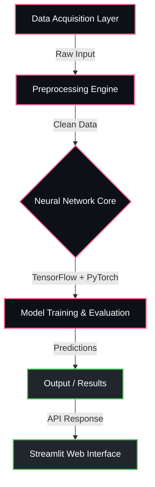

<div align="center">


<p align="center">
  
  
  
  
</p>

  
  
  


</div>

---

## Overview

> Climate forecasting model using satellite NDDI data.

**Drought Early Warning NDDI LSTM ** is a proprietary machine learning / ai system engineered by **Karthik Idikuda**. It leverages Streamlit, PyTorch, TensorFlow for its core functionality.

<br/>

## System Architecture



<br/>

## Project Structure

```
Drought-Early-Warning-NDDI-LSTM-/
  .gitignore
  AI.ipynb
  COMPREHENSIVE_UPGRADE_SUMMARY.md
  DASHBOARD_GUIDE.md
  LICENSE
  LOADING_IMPROVEMENTS.md
  MODEL_COMPARISON_UPDATE.md
  Procfile
  README.md
  UPVillageSchedule.csv
  .devcontainer/
    devcontainer.json
  .streamlit/
    config.toml
  catboost_info/
    catboost_training.json
    learn_error.tsv
    test_error.tsv
    time_left.tsv
  scripts/
    smoke_test.py
  src/
```

<br/>

## Technical Specifications

| Attribute | Detail |
|:---|:---|
| **Primary Language** | `Jupyter Notebook` |
| **Project Category** | `Machine Learning / AI` |
| **Total Source Files** | `63` |
| **Frameworks** | `Streamlit`, `PyTorch`, `TensorFlow` |
| **Key Dependencies** | `torch` | `scikit-learn` | `pyyaml` | `plotly` | `tensorflow` | `requests` | `pandas` | `pydantic` | `scipy` | `rasterio` | `streamlit` | `kaggle` | `keras` | `numpy` | `catboost` |
| **Intellectual Property** | `Strictly Proprietary` |

<br/>

## STRICT LEGAL WARNING & LICENSE

> **PROPRIETARY AND CONFIDENTIAL**

This software and all associated documentation are the **exclusive property of Karthik Idikuda**.

- **NO PERMISSION IS GRANTED** to use, copy, modify, merge, publish, distribute, sublicense, or sell copies of this software without explicit, written consent from the author.
- **UNAUTHORIZED USE WILL RESULT IN SEVERE LEGAL ACTION.** Any individual or organization found using, referencing, or deploying this code without paying the required licensing fees will face immediate litigation, financial penalties, and potentially criminal prosecution where applicable by law.
- **TO OBTAIN A LEGAL LICENSE**, you must directly contact Karthik Idikuda to negotiate payment terms.

*By accessing this repository, you acknowledge and accept these strict proprietary terms.*

---

<div align="center">
  
</div>

<!-- TRACKING: S0ktRHJvdWdodC1FYXJseS1XYXJuaW5nLU5EREktTFNUTS0tVFJBQ0s= -->
